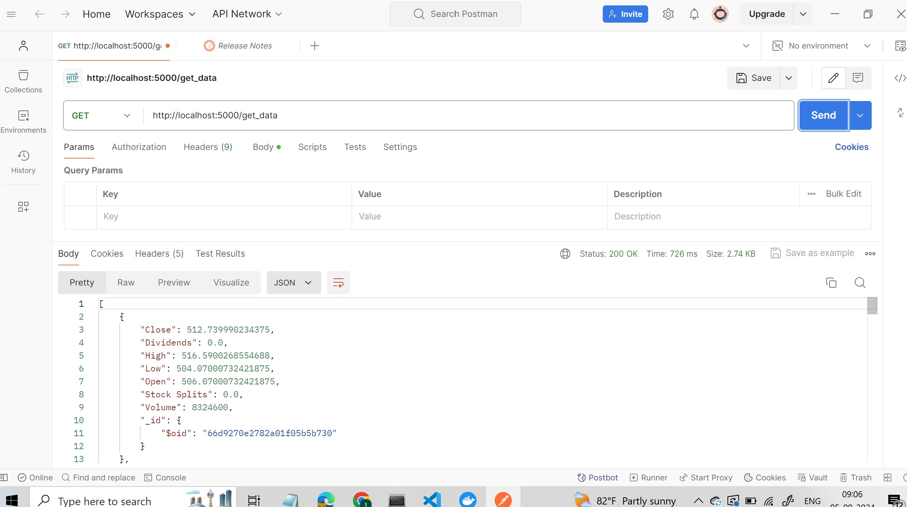

## Procedure

# (01) Created an API what it does is run continously and update the stock prices in to a mongodb database.I have dockarize it locally run the imge and make an pi call to update the mongodb locally once . I have checked using postman to chekc if it works .

## Then i have build a dashboard that fetch the data from the mongodb make live updates

!(dashboard.jpg)
